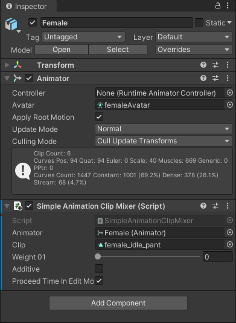

# Timeline Mixer ⏳

Timeline Mixer allows for blending between currently playing (or paused) timeline animation and other animations per animator.

# Quick Start 🏇🏼

1) <kbd>Add</kbd> a ``TimelineGraph Modification Manager`` component to your scene for every timeline you want to inject into and <kbd>drag</kbd> the ``Timeline Director`` you want to modify in the Director field.

2) <kbd>Add</kbd> a ``Simple Animation Clip Mixer`` component to your scene and <kbd>reference</kbd> the ``Animator`` component you want to blend animation with.

3) <kbd>Add a reference</kbd> to the ``Simple Animation Clip Mixer`` to your ``TimelineGraph Modification Manager`` list of mixers.

# Advanced 💡

You can create your own mixer behaviours by implementing a ``TimelineAnimationMixer`` and overriding the ``OnConnected`` and ``OnUpdate`` methods.

- ``OnConnected`` is called once when the new mixer is injected into the timeline's playable graph. Use it to add inputs to the injected ``AnimationLayerMixerPlayable`` node by calling the extension method ``mixer.AddClip`` and store the output index for blending.

- ``OnUpdate`` is called every frame with a reference to the injected mixer node and manager. Use it to update the weights on 

## Playing animation while Timeline is paused
To play animation while the ``PlayableDirector`` is paused you can call the ``RequireTimelineEvaluate()`` method on ``TimelineGraph Modification Manager`` from the ``OnUpdate`` method of your ``TimelineAnimationMixer``. This will trigger a call to ``Evaluate`` on the ``PlayableDirector`` at the end of the update.

# Contact ✒️
<b>[needle — tools for unity](https://needle.tools)</b> • 
[@NeedleTools](https://twitter.com/NeedleTools) • 
[@marcel_wiessler](https://twitter.com/marcel_wiessler) • 
[@hybridherbst](https://twitter.com/hybdridherbst)